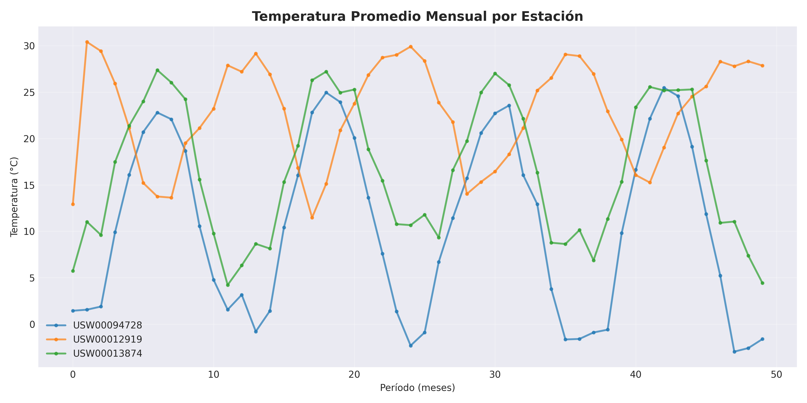
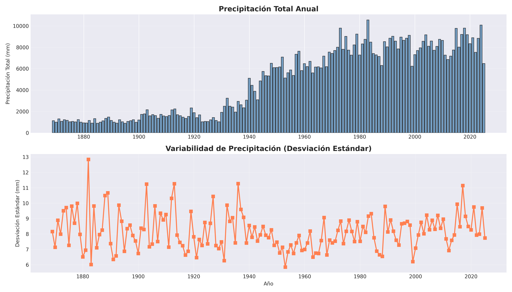
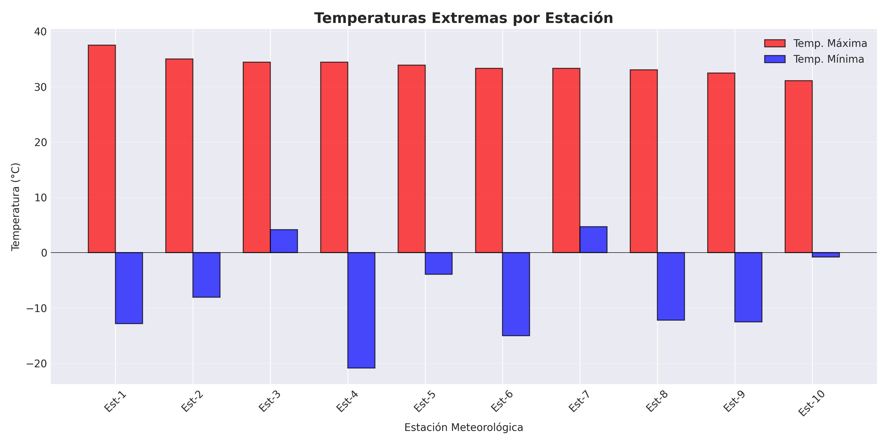
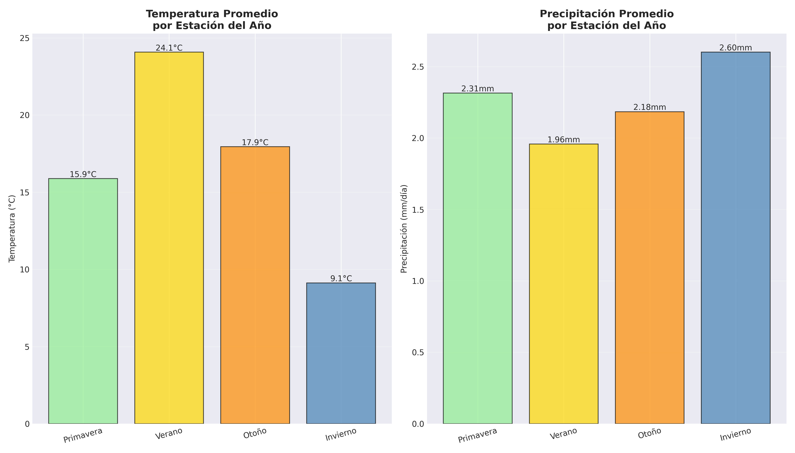

# 🌤️ Proyecto 2: Análisis Climático con PySpark

Análisis de datos meteorológicos de NOAA utilizando Apache PySpark para el curso de Bases de Datos no Relacionales (ITAM).

## 📋 Descripción

Este proyecto procesa y analiza más de 0.5 GB de datos climáticos históricos del **Global Historical Climatology Network (GHCN-Daily)** de NOAA, realizando 5 procesamientos diferentes:

1. **Temperatura Promedio Mensual** - Estadísticas mensuales por estación
2. **Precipitación Anual** - Totales y variabilidad anual
3. **Extremos Climáticos** - Récords de temperatura por ubicación
4. **Análisis Estacional** - Comparación entre estaciones del año
5. **Tendencias Temporales** - Evolución y correlación de variables

## 🚀 Inicio Rápido

### Prerequisitos

- Python 3.8+
- Java 8+ (requerido por Spark)
- Git

### Instalación

```bash
# Clonar repositorio
git clone https://github.com/TU_USUARIO/proyecto2-pyspark-clima.git
cd proyecto2-pyspark-clima

# Crear entorno virtual
python -m venv .venv
source .venv/bin/activate  # En Windows: .venv\Scripts\activate

# Instalar dependencias
pip install -r requirements.txt
```

### Ejecución

```bash
# 1. Descargar datos de NOAA (toma 10-15 min)
python descargar_datos_noaa.py

# 2. Ejecutar análisis con PySpark (toma 5-10 min)
python analisis_clima_pyspark.py

# 3. Ver resultados en la carpeta resultados/
```

## 🐳 Usando Docker (Recomendado)

```bash
# Construir imagen
docker-compose build

# Descargar datos
docker-compose run pyspark-app python descargar_datos_noaa.py

# Ejecutar análisis
docker-compose run pyspark-app python analisis_clima_pyspark.py

# O usar Jupyter Notebook
docker-compose up jupyter
# Abrir http://localhost:8888
```

## 📁 Estructura del Proyecto

```
proyecto2-pyspark/
├── config.py                      # Configuración centralizada
├── utils.py                       # Funciones auxiliares
├── descargar_datos_noaa.py        # Descarga de datos
├── analisis_clima_pyspark.py      # Análisis principal
├── requirements.txt               # Dependencias Python
├── Dockerfile                     # Imagen Docker
├── docker-compose.yml             # Orquestación Docker
├── .gitignore                     # Archivos ignorados por Git
│
├── datos/                         # Datos (no en Git)
│   ├── datos_noaa/               # CSVs crudos por estación
│   ├── datos_clima_noaa.csv      # Datos unificados
│   └── datos_clima_noaa_procesado.csv
│
├── resultados/                    # Gráficas generadas
│   ├── grafica_1_temp_mensual.png
│   ├── grafica_2_precipitacion.png
│   ├── grafica_3_extremos.png
│   ├── grafica_4_estacional.png
│   └── grafica_5_tendencia.png
│
└── docs/                          # Documentación
    ├── documento_proyecto.docx
    └── presentacion_proyecto.pptx
```

## 📊 Resultados

El proyecto genera 5 gráficas profesionales:

<p align="center">
  
  
</p>

<p align="center">
  
  
</p>

<p align="center">
  
</p>

## 🛠️ Tecnologías

- **Apache PySpark 3.5** - Procesamiento distribuido de Big Data
- **Pandas** - Conversión de datos para visualización
- **Matplotlib** - Generación de gráficas
- **NOAA GHCN-Daily** - Fuente de datos climáticos

## 📝 Documentación

- [Documento completo del proyecto](docs/documento_proyecto.docx) (10+ páginas)
- [Presentación](docs/presentacion_proyecto.pptx) (6 diapositivas)
- [Guía de instalación detallada](INSTALL.md)

## 👥 Equipo

**Equipo:** [Nombre del Equipo]

**Integrantes:**
- [Nombre 1] - [GitHub](https://github.com/usuario1)
- [Nombre 2] - [GitHub](https://github.com/usuario2)
- [Nombre 3] - [GitHub](https://github.com/usuario3)
- [Nombre 4] - [GitHub](https://github.com/usuario4)

## 📅 Timeline

- **Nov 19, 2025** - Presentación preliminar
- **Dic 1-3, 2025** - Presentación final

## 📄 Licencia

Este proyecto es parte del curso de Bases de Datos no Relacionales del ITAM.

## 🙏 Agradecimientos

- Dr. Felipe López G. - Profesor del curso
- NOAA - Por proporcionar datos climáticos públicos
- Apache Foundation - Por Apache Spark

---

**ITAM - Bases de Datos no Relacionales - 2025**